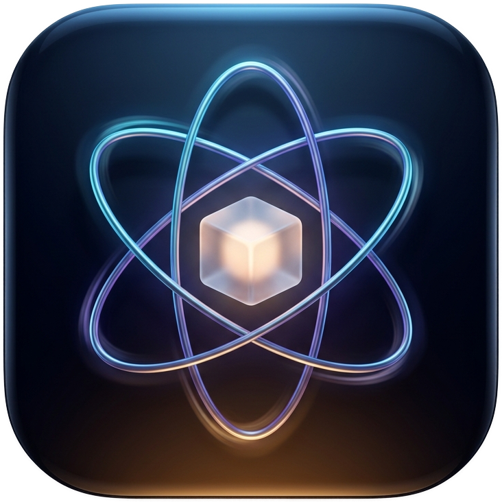
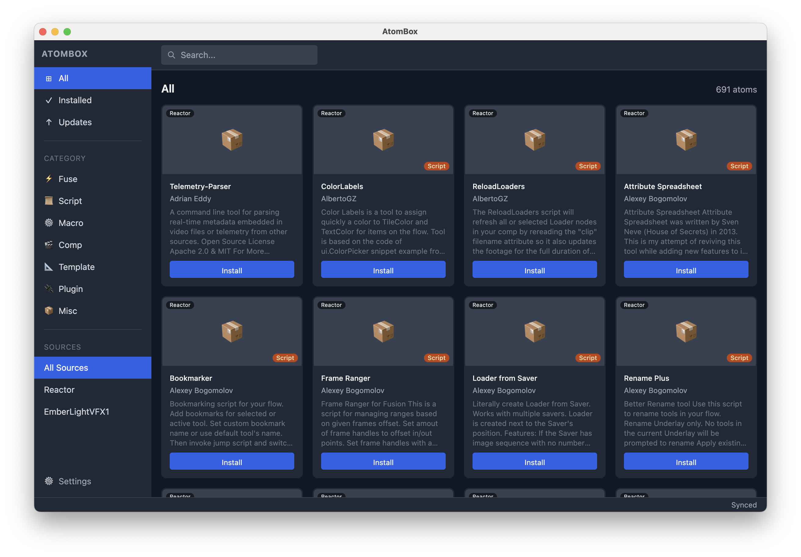

<div align="center">
  

  # AtomBox

  **A modern GUI package manager for DaVinci Resolve Fusion**

  Browse, install, and manage Reactor atoms — without touching a terminal.

  [](https://github.com/inewland53/atombox/releases/latest)
  [](https://github.com/inewland53/atombox/releases/latest)
  [](LICENSE)

  

</div>

---

## Why AtomBox?

Managing DaVinci Resolve Fusion plugins manually means hunting GitLab repos, downloading files, and placing them in exactly the right folder — then repeating that for every update. The official [Reactor](https://gitlab.com/WeSuckLess/Reactor) installer works, but it's a script, not a GUI.

AtomBox is a native desktop app that gives you a **searchable, filterable interface for the full Reactor catalog**. Browse atoms by category, read descriptions, install or update with one click, and track what's installed — all without leaving your desk. It's the DaVinci Resolve Fusion plugins manager that power users have been missing.

## ✨ Features

- **Browse & search** the full Reactor catalog by name, author, or category
- **One-click install, update, and uninstall** — no manual file management
- **Auto-detects** your DaVinci Resolve Fusion path on macOS and Windows
- **Custom repositories** — add atom repos from GitLab, GitHub, local folders, or HTTP servers
- **Real-time install progress** with per-file tracking and retry logic
- **Update detection** — see at a glance which installed atoms have newer versions available
- **Import/export** repository configurations to share with your team

## ⬇ Download

| Platform | Installer |
|----------|-----------|
| macOS | [AtomBox.dmg →](https://github.com/inewland53/atombox/releases/latest) |
| Windows | [AtomBox Setup.exe →](https://github.com/inewland53/atombox/releases/latest) |

> **First-launch security warning:** The app is not code-signed.
> - **Mac:** Right-click → "Open" → "Open" (one time only)
> - **Windows:** "More info" → "Run anyway"

## 🚀 Quick Start

1. Launch AtomBox — it auto-detects your DaVinci Resolve Fusion folder (internet connection required to fetch the catalog)
2. Browse the Reactor catalog, search by name/author, or filter by category
3. Click an atom to view details, then **Install** / **Update** / **Uninstall**
4. Restart DaVinci Resolve to load newly installed atoms
5. If auto-detection fails: **Settings → General** → set your Fusion folder path manually

## ⚙️ Custom Repositories

Add your own `.atom` repositories from **Settings → Repositories**:

- **GitLab / GitHub** — any public repo containing an `/Atoms` directory
- **Local folder** — a directory on your machine with `.atom` files
- **HTTP server** — a URL serving an `index.json` and `.atom` files

Tag repos with a category label (e.g. "Work", "Personal") — it appears as a sidebar filter. Export your repo list as JSON to share with teammates; import a shared list with one click.

## 🏗 Build from Source

```bash
git clone https://github.com/inewland53/atombox.git
cd atombox
npm install
npm start          # dev mode
npm run make       # build installers
npm test           # run tests
```

## 📄 License

MIT © [Ian Newland](https://github.com/inewland53)
